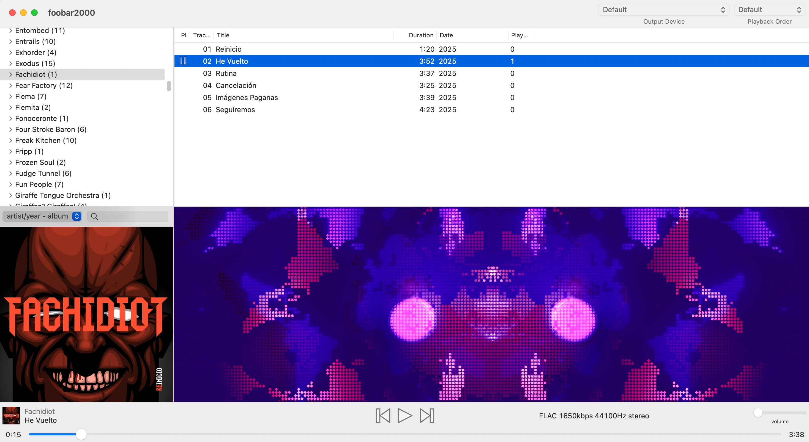

# projectMacOS

Open-source music visualizer for [foobar2000](https://www.foobar2000.org) on MacOS. Watch a [demo](https://www.youtube.com/watch?v=ymC7oYKmVrI) of projectMacOS in action.

- Requires MacOS 13 (Ventura) or later.
- It should work on foobar2000 2.x and later.

## Installation

- Download `foo_vis_projectMacOS.fb2k-component` from the [releases page](https://github.com/gabitoesmiapodo/projectMacOS/releases).
- Install from foobar2000's components section: `foobar2000 -> Settings -> Components -> [+]` and select `foo_vis_projectMacOS.fb2k-component`.

## Adding the visualization to your layout

You can add the component to your layout in `View / Layout / Edit Layout` placing the `projectMacOS` in any place you like.

For example, if you use this template:

```
splitter horizontal style=thin
 splitter vertical style=thin
  splitter horizontal style=thin
   albumlist
   albumart type="front cover"
  splitter horizontal style=thin
   playlist
   projectMacOS
 playback-controls
```

You should see something like this:



### Option 2

You can always manually add the `projectMacOS` component in your preferred location in the layout.

## Preset installation and use

Follow these steps if you want to use the presets pack:

- Download `projectMacOS.zip` from the [releases page](https://github.com/gabitoesmiapodo/projectMacOS/releases).
- Place it in the default location: `~/Documents/foobar2000/projectMacOS.zip` (that's just your documents folder, create a `foobar2000` folder if it doesn't exist, and place the zip file there).

Optionally you can extract the zip file (keep the folder structure as it is) and delete the zip file, in case you want to edit the presets, add more, or remove some.

## Controls

Right-click anywhere on the visualization to open the context menu.

| Control | Description |
|---------|-------------|
| **Presets** | Browse and load presets from the preset library. |
| **Pause / Resume** | Freeze or resume the current visualization. |
| **Previous / Next** | Switch to the previous or next preset. |
| **Random Pick** | Load a random preset. |
| **Favorites** | Save the current preset to your favorites list for quick access. Use Manage to export or import your list as JSON. |
| **Shuffle Presets** | Automatically switch to a random preset after the configured delay. |
| **Cycle Favorites** | Automatically cycle through your saved favorites in Ascending, Descending, or Random order, using the same delay. |
| **Delay** | Set the delay between automatic preset switches (15s, 30s, 45s, 1m). Applies to both Shuffle and Cycle Favorites. |
| **Double-click** | Toggle fullscreen mode. |
| **ESC** | Exit fullscreen. |

## Dev Info

### Requirements

- Xcode, and command line tools.
- `cmake`, `ninja`, and standard build tools.
- `foobar2000` installed in `/Applications/foobar2000.app`

### Build and test

Xcode project: `mac/projectMacOS.xcodeproj`

Command line, from repository root:

```bash
# First-time setup: build deps + component + run tests + deploy
bash scripts/deploy-component.sh --build

# Rebuild dependencies only
bash scripts/build-deps.sh

# Rebuild component only (skip deps build), then test + deploy
SKIP_DEPS_BUILD=1 bash scripts/deploy-component.sh --build

# Run tests only
bash scripts/run-tests.sh
```

## Acknowledgements

- Initally a fork of [foo_vis_projectM](https://github.com/djdron/foo_vis_projectM), a foobar2000 visualization plugin.
- Uses code taken from [projectM](https://github.com/projectM-visualizer/projectm) as a dependency.
- Uses [foobar2000 SDK](https://www.foobar2000.org/SDK) as a dependency.
- Preset library from [Creme of the Crop presets](https://github.com/projectM-visualizer/presets-cream-of-the-crop).

----

*This project is distributed under the [GNU Lesser General Public License v2.1](LICENSE.md)*
